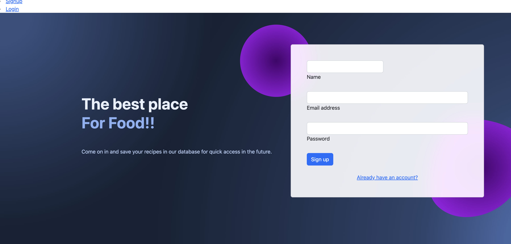
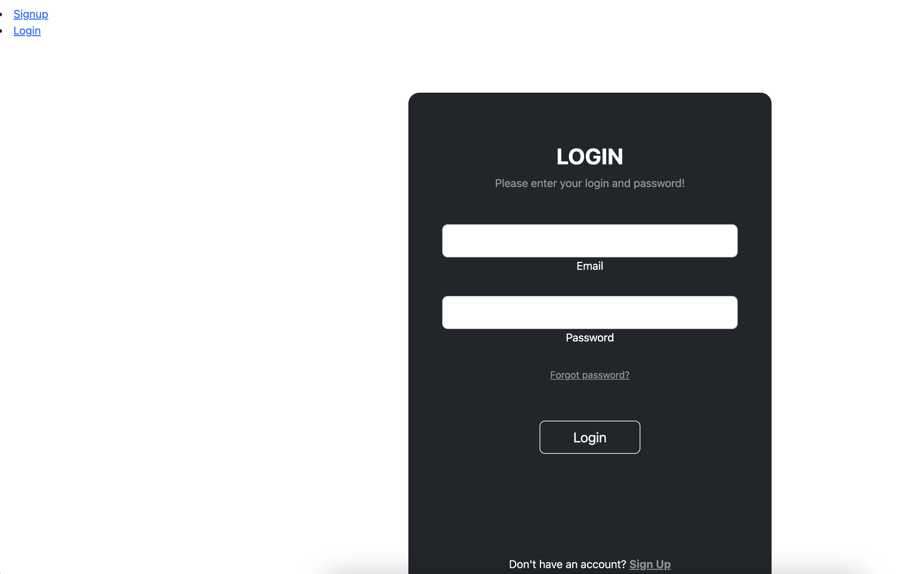
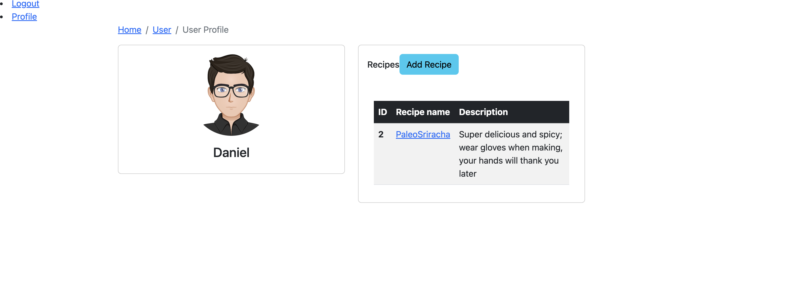
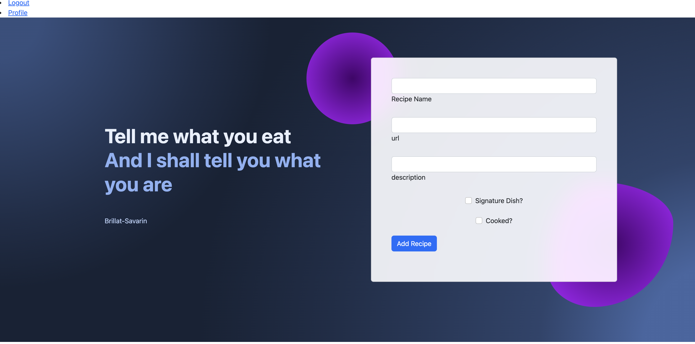
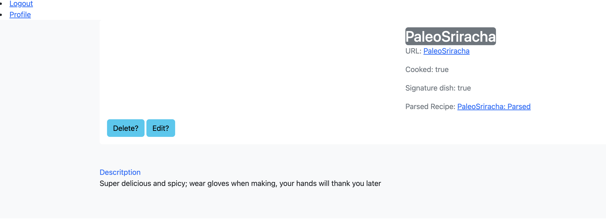
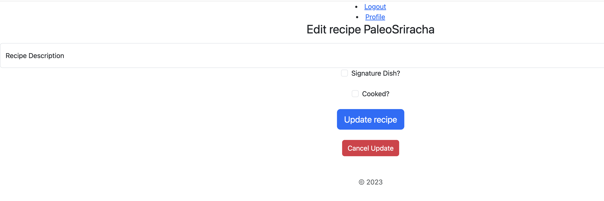
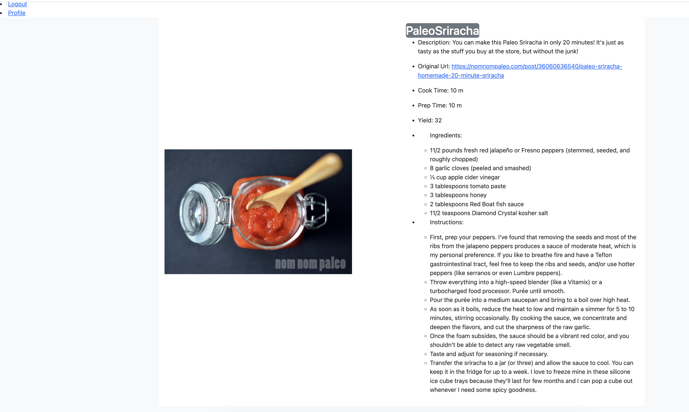
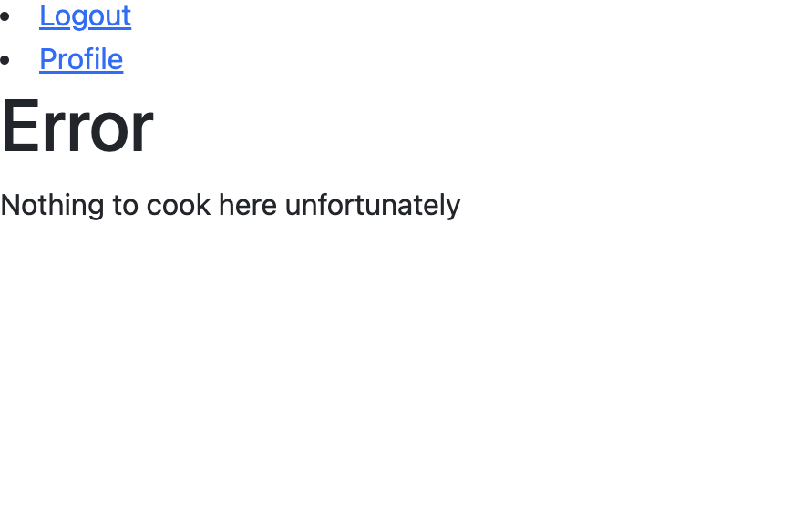

# `FunWithFood`

## Tell me what you eat and I shall tell you what you are ~`Brillat Savarin`

## Let's get cooking

This app will allow you to track your favorite recipes that you have found on the internet. You will be able to create a profile, 
add, edit and delete recipes along with an api that will parse the recipe page and extract only the recipe. This will save you the hassle of looking through the whole recipe page for the recipe.

## Ingredients

* Sequelize user model / migration
* Settings for PostgreSQL
* Passport and passport-local for authentication
* Sessions to keep user logged in between pages
* Flash messages for errors and successes
* Passwords that are hashed with BCrypt
* EJS Templating and EJS Layouts
* Axios integration for database hit

### User CookBook

| Column Name | Data Type | Notes |
| --------------- | ------------- | ------------------------------ |
| id | Integer | Serial Primary Key, Auto-generated |
| name | String | Must be provided |
| email | String | Must be unique / used for login |
| password | String | Stored as a hash |
| createdAt | Date | Auto-generated |
| updatedAt | Date | Auto-generated |

### Recipe CookBook

| Column Narecipesata Type | Notes |
| --------------- | ------------- | ------------------------------ |
| id | Integer | Serial Primary Key, Auto-generated |
| recipeName | String | Name of Recipe |
| description | String | a description of the recipe |
| url | String | used to parse data and  to reference recipe |
| signatureDish | Boolean | indicates whether this is a signature dish or not |
| cooked | Boolean | Indicates if this has been cooked |
| createdAt | Date | Auto-generated |
| updatedAt | Date | Auto-generated |

### Default recipes

| Method | Path | Location | Purpose |
| ------ | ---------------- | -------------- | ------------------- |
| GET | / | server.js | Home page |
| GET | /auth/login | auth.js | Login form |
| GET | /auth/signup | auth.js | Signup form |
| POST | /auth/login | auth.js | Login user |
| POST | /auth/signup | auth.js | Creates User |
| GET | /auth/logout | auth.js | Removes session info |
| GET | /profile | server.js | Regular User Profile |
| GET | /recipe/add/:userId | recipe.js | Create recipe entry screen |
| GET | /recipe/view/:recipeName | recipe.js | views the indicated recipe |
| GET | /recipe/delete/:recipeName | recipe.js | Confirmation page for recipe deletion |
| GET | /recipe/edit/:recipeName | recipe.js | Form for updating recipe |
| GET | /recipe/parsed/:recipeName | recipe.js | Links to page with parsed recipe |
| POST | /recipe/add | recipe.js | Creates Recipe |
| PUT | /recipe/:recipeName | recipe.js | Updates selected recipe |
| DELETE | /recipe/:recipeName | recipe.js | Deletes selected recipe |


## `1` Fork & Clone Project & Install Dependencies
`1` The first thing that we are going to do is `fork` and `clone`

`2` Now we are going to install the current dependencies that are listed inside of `package.json`
```text
npm install
```

`3` setup a `.env` file and add `SECRET_SESSION=YOUR_KEY_HERE` and `API_KEY=API_KEY` and `API_HOST=API_HOST`
  - obtain `API_KEY` and `API_HOST` by signing up here: 
    - [cookr-api](https://rapidapi.com/dashdash/api/cookr-recipe-parser): API to parse recipe from URL's. Free sign up for up to 100 hits per month, signup through rapid API

`4` We have the current packages for `authentication`. These are the following packages:

-  [bcryptjs](https://www.npmjs.com/package/bcryptjs): A library to help you hash passwords. ( [wikipedia](https://en.wikipedia.org/wiki/Bcrypt) ) 
    - Blowfish has a 64-bit block size and a variable key length from 32 bits up to 448 bits.
- [connect-flash](https://github.com/jaredhanson/connect-flash): The flash is an area of the session used for storing messages that will be used to to display to the user. Flash is typically used with redirects.
- [passport](https://www.passportjs.org/docs/): Passport is authentication middleware for Node.js. It is designed to do one thing authenticate requests. There are over 500+ strategies used to authenticate a user; however, we will be using one - *passport-local* Passport is authentication middleware for Node. It is designed to serve a singular purpose: authenticate requests
- [passport-local](http://www.passportjs.org/packages/passport-local/): The local authentication strategy authenticates users using a username and password. The strategy requires a verify callback, which accepts these credentials and calls done providing a user. [passport-local](http://www.passportjs.org/packages/passport-local/)
- [express-session](https://github.com/expressjs/session): Create a session middleware with given *options*.
- [method-override](https://github.com/expressjs/method-override): Lets you use HTTP verbs such as PUT or DELETE in places where the client doesn't support it.
- [axios](https://axios-http.com/docs/intro): a promise-based HTTP Client for node.js and the browser. It is isomorphic (= it can run in the browser and nodejs with the same codebase). On the server-side it uses the native node.js http module, while on the client (browser) it uses XMLHttpRequests.


## `2` Create Database & Update Sequelize Config

`1` Update **`config.json`** file with the following:

```json
{
  "development": {
    "database": "funwithfood",
    "host": "127.0.0.1",
    "dialect": "postgres"
  },
  "test": {
    "database": "funwithfood",
    "host": "127.0.0.1",
    "dialect": "postgres"
  },
  "production": {
    "use_env_variable": "DATABASE_URL",
    "dialect": "postgres",
    "dialectOptions": {
        "ssl": {
          "require": true,
          "rejectUnauthorized": false
        }
    }
  }
}
```

`2` Create database `funwithfood`

```text
sequelize db:create
```


## `3` Analyze File Structure

```text
├── config
│   └── config.json
├── controllers
│   └── auth.js
├── models
│   └── index.js
├── node_modules
│   └── ...
├── public
│   └── assets
│   └── css
│       └── style.css
├── test
│   └── auth.test.js
│   └── index.test.js
│   └── profile.test.js
│   └── user.test.js
├── views
│   └── auth
│       └── login.ejs
│       └── signup.ejs
│   └── index.ejs
│   └── layout.ejs
│   └── profile.ejs
├── .gitignore
├── package-lock.json
├── package.json
├── README.md
├── server.js
```

- `config.json`: Where you need to configure your project to interact with your postgres database.
- `controllers`: The folder where all of your controllers ( routes ) will go to control the logic of your app.
- `models`: The folder where all the models will be stored that will interact with the database.
- `node_modules`: The folder that is generated by **npm** that stores the source code for all dependencies installed.
- `public`: is to have those views that would be publicly accessible in the application. ex. `style.css`
- `test`: The folder where all your test that you make will be stored. ex. `auth.test.js`
- `views`: The folder where all the app's templates will be stored for displaying pages to the user. ex. `login.ejs`
- `.gitignore`: A hidden file that will hide and prevent any files with to NOT get pushed to Github.
- `package-lock.json`: is automatically generated for any operations where npm modifies either the `node_modules` tree, or `package.json`.
- `package.json`: The settings file that stores scripts and list of dependencies that are used inside your app.
- `README.md`: The main markdown file that written to explain the details your app.
- `server.js`: The main file that controls the entire application.

## Screenshots



The page for signing up
===

Login page
===

Profile page
===

page for adding recipes
===

Recipe view page with buttons for editing and deleting as well as a link to the original recipe and the parsed recipe
===

page to enter edit details
===

data parsed from recipe URL to highlight the recipe
===

confirmation for deleting
===
  
404 error page
===