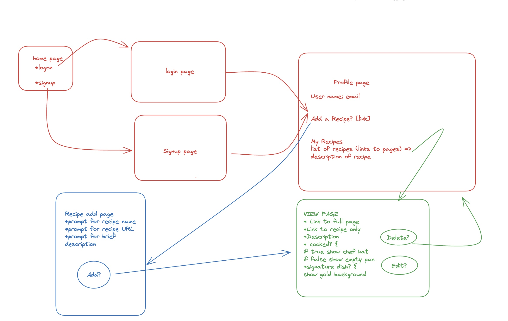

# Project 2 Planning

## Part 1

Review the Project 2 requirements and check out some [examples](https://romebell.gitbook.io/sei-802/projects/past-projects/project2).

In this space below, list **THREE** ideas for your Project 2. For each idea, include [user stories](https://www.atlassian.com/agile/project-management/user-stories) for each idea and a link to the API(s) you want to use for it.

--------------------------------------------------------
1. Recipe app => a place to save recipes. Includes a tool to extract just the recipe from the page
2. 
3.
---------------------------------------------------------

Make a PR when you're done!

---

## Part 2

In the space below:
* either embed or link a completed ERD for your approved P2 idea
* if there are any changes/additions to your user stories, place your full set of revised user stories here
* either embed or link wireframes for every page of your app

----------------------------------------------------------
### ERD

----------------------------------------------------------
### User Stories
*	As a user I want to be able to login in to my account
    *	Acceptance: selecting login takes one to logon page
    *	If an account does not exist redirect to signup page
    *	After logon direct to profile page
*	As a user I want to be able to create an account if I do not have one
    *	Acceptance: selecting signup will take to account creation page
    *	If an account already exists take to login page
    *	After creation redirect to profile page
*	As a user I want to be directed to a profile page once I login
    *	Acceptance: after login in successfully show profile page consisting of user name; email; preferences; edit button; search  button; list of recipes
*	As a user I would like to edit demographics
    *	Selecting edit redirects to edit page to edit preferences
*	As a user I would like to be able to mark a dish as a signature dish
    *	Acceptance: selecting star icon grants recipe a gold background
*	As a user I would like to remove a signature status
    *	Acceptance: deselecting star icon removes gold background from recipe
*	As a user when I select a recipe in my list I would like to be directed to the recipe
    *	Display as a list of links that redirect to recipe page
*	When viewing a recipe I would like to be able to go to the recipe page
    *	Acceptance: link to full recipe takes user to full page
*	When viewing the recipe I would like to be able to go the parsed recipe
    *	Acceptance: parsed link uses API to go to parsed recipe data
*	When viewing a recipe I would like to be able to delete the recipe
    *	Acceptance: while viewing a recipe and selecting delete button = > removes recipe from user list = > redirect to profile page
*	When viewing a recipe I would like to be able to mark that I have cooked it
    *	Acceptance: after selecting cooked recipe turns blue; else red background
*	After selecting recipe add button redirect to the add recipe page
    *	Acceptance: successful redirect to add page with recipe name, recipe url and description prompt
*	When adding recipe I will enter in the name, url and description then select add
    *	Acceptance: after filling in fields redirect to main page
*	Upon selecting log out return me to the main page
    *	Acceptance: returns to main page

----------------------------------------------------------
### Wireframes

----------------------------------------------------------

Make a PR when you're done!


## Requirements Inside `Project Board`

`card` FUNDAMENTALS
```
### FUNDAMENTALS
- [ ] Deployed (e.g. Heroku)
- [ ] Site has basic functionality related to its goal
- [ ] At least 2 GET routes (other than auth)
- [ ] At least 1 POST route
- [ ] At least 1 DELETE route
- [ ] At least 1 PUT route
```

`card` SUFFICIENT DIFFICULTY
```
### SUFFICIENT DIFFICULTY: At least 1 of the following: 
- [ ] Use of an API
- [ ] Advanced Database Relationships
- [ ] Sockets
- [ ] Scraping
- [ ] OAuth
- [ ] Other
```

`card` AUTH/SECURITY
```
### AUTH/SECURITY (Mostly From Template Boilerplate)
- [ ] Log in works (required: boilerplate or better)
- [ ] Sensible error messages for bad login info  (boilerplate or better)
- [ ] Passwords hashed in database
- [ ] Passwords in form are input type="password" (dots)
- [ ] Password verification is checked
- [ ] Can't sneak edit/delete data that I don't own by typing in random ids
```
`card` GITHUB USAGE
```
### GITHUB USAGE
- [ ] Appropriate Use of Github
- [ ] `README` is included and is descriptive
- [ ] `.gitignore` properly set up
- [ ] No API keys in Github code (used a .env file)
- [ ] Multiple commits per day
- [ ] Repo up on day 1 of project week or sooner
- [ ] `README` has *Installation Instructions*
```

`card` DATABASE USAGE
```
### DATABASE USAGE
- [ ] At least 2 Models other than join tables (required)
- [ ] Relationships were set up appropriately between models
- [ ] Avoided global variables, storing data in files, etc
- [ ] No raw file/image data stored in database, etc
```

`card` CODE STYLE
```
### CODE STYLE
- [ ] Generally DRY code / No enormous files
- [ ] Proper indentation (or mostly pretty good!)
- [ ] Naming conventions kept
- [ ] No glaring logic errors
```
`card` USER EXPERIENCE
```
### USER EXPERIENCE
- [ ] Effort was put into design
- [ ] No broken links (server errors or 404s)
- [ ] Typing a purposely bad link renders an error ejs page
- [ ] Content is responsive to screen size changes
- [ ] No glaring alignment or grid errors
```
